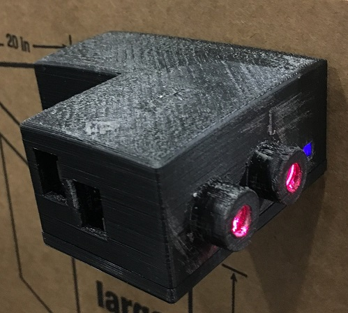

# Laser Integrated Digital Turnstile System (LIDT)

[](https://www.gnu.org/licenses/gpl-3.0)

REST API for laser integrated digital turnstile system used to track pedestrian traffic. Written using the Python Flask framework.



## Dependencies

* Flask 0.12.2
* Flask-cors 3.0.6
* MySQL-python 1.2.5

## Install

Tested on Ubuntu 18.04.1. Follow these steps to run on Ubuntu/Debian:

1. Install Python 2.7.14
2. Install pip and virtualenv ([information here](https://docs.python-guide.org/dev/virtualenvs/))
3. Run this fix for Debian MySQL:

    `sudo apt-get install libmysqlclient-dev`

4. Run the following commands:
	`git clone https://github.com/cameronnapoli/laser-integrated-digital-turnstile-backend.git`
	`cd laser-integrated-digital-turnstile-backend`
    `virtualenv env`
    `source env/bin/activate`
    `pip install -r requirements.txt`

Then you can run your server by following the steps in the Usage section. If you would like to exit virtualenv, run the `deactivate` command:


### Note

You must set up MySQL yourself for the API to work. [This is a good place to start](https://dev.mysql.com/doc/mysql-getting-started/en/).


## Usage

Run on localhost:80 with:
```
python application.py
```

To run pointing to localhost db and on localhost:5000 use 
```
python application.py --debug
```

<br />

# API Endpoints

## Generate Auth Token
    /gen_auth_token
#### Description
Generate an authentication token to be passed into subsequent API calls.

<br />

## Register Event
    /register_event
#### Description
Register an event to the MySQL DB from a sending device.

<br />

## Debug Preview
    /debug_preview
#### Description
Print formatted HTML debug info for a specific device.

<br />

## Get All Client Devices
    /GetAllClientDevices
#### Description
Get all device ID's associated with a certain client.

<br />

## Get Device Count
    /GetDeviceCount
#### Description
Get number of entry events and exit events for a certain device.

<br />

## Get All Device Count History
    /GetAllDeviceCountHistory
#### Description
Group device entries and exits over a certain interval at the specified subinterval.

<br />

## Add Device
    /AddDevice
#### Description
Add a device to the MySQL DB.
